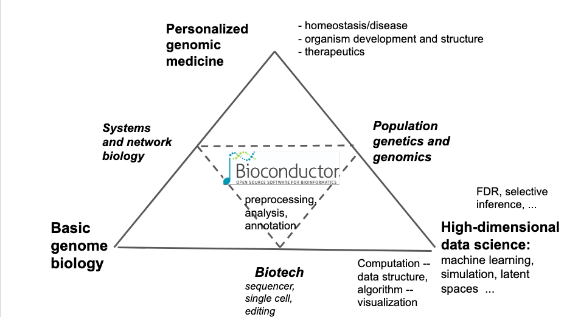

# Bioconductor 3.12 at Harvard: A series of hands-on workshops

Consider the following schematic of topics arising in genomic data science.

This diagram was constructed as preparation for a curriculum on
statistical methods for functional genomics to be offered in the
summer of 2020 at Cold Spring Harbor Laboratory (canceled).

The aim is
to take students who are primarily concerned with experimental methods 
of basic genome biology (bottom left corner), and build their 
expertise up towards the apex of the triangle, so that 
they are better equipped to use data science to pose 
and answer broad questions about organism structure and development, homeostasis 
and disease.  

This process inevitably leads through biotechnological innovation that 
generates high-dimensional data.  Thus students must travel along the bottom 
edge of the triangle in addition to moving up.  They must
complement their basic science methods and knowledge by staying abreast 
of newest developments in systems and network biology, to ascend 
along the left edge of the triangle.  Applications to genomic
medicine require understanding of the methods and findings of
population genetics, requiring travel up the right edge of the triangle.

We place Bioconductor 
at the triangle's center as the fundamental locus 
of computational resources to enable ascent.  For two decades, Bioconductor 
has facilitated the parsing and modeling of genome-scale experimental data, 
providing rational high-level access to annotated, interpretable data at the 
level of genome, transcriptome, or base-pair.  By blending these data 
models with R, state-of-the-art methods of visualization and statistical inference 
are immediately available to Bioconductor users.  Resources for pathway and 
network annotation are also readily available for amalgamation with experimental 
readouts.  In two weeks’ time, instructors in the Cold Spring Harbor course
introduce
working biologists to functional programming, software package use, session management, 
reproducible research methods, and various aspects of statistical learning, typically 
adapted directly to the specific experimental modalities of interest to 
the student.
 

